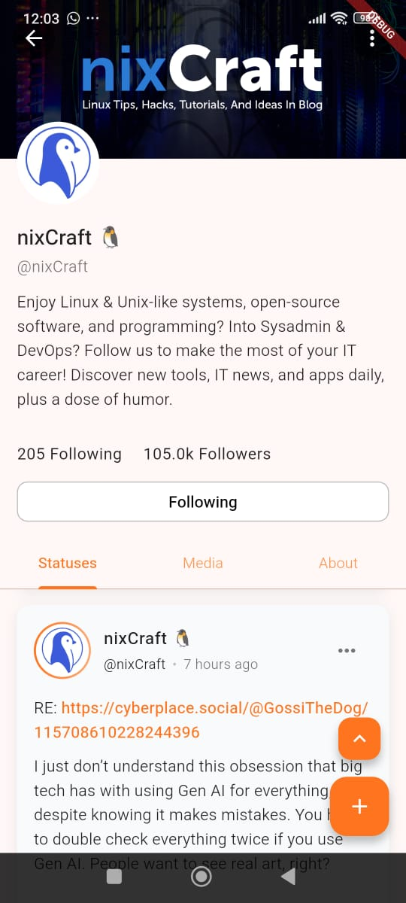

## 📱 Why Post — Fediverse Client for Mobile

Why Post is a lightweight, modern Fediverse client for Android and IOS (Not tested) written in Flutter, designed to give users a fast, easy to use and pleasant way to interact with decentralized social networks such as Mastodon, Akkoma, Gotosocial and other similar mastodon api platforms.

The app focuses on speed, easy to use, and a smooth mobile-first user experience.


## Overview

Overview app

<p align="center">
  
  
</p>

## Supported instances

| Instances             | Supported                                                                |
| ----------------- | ------------------------------------------------------------------ |
| Mastodon   | ✅ Works      |
| GoToSocial | ✅ Works      |
| Akkoma     | ✅ Works      |
| Pleroma    | ⚠️ Not tested |
| Misskey    | ❌ Not working|
| Friendica  | ⚠️ Minor issues |


## Supported Platform

| Platform             | Supported                                                                |
| ----------------- | ------------------------------------------------------------------ |
| Android 15   | ✅ Supported      |
| Other Version Android   | ⚠️ Not tested      |
| IOS | ❌ Not Supported      |


## Features

- 🔐 Login to any Fediverse instance (if supported)
- 🏠 Home / Local / Public / Trends timelines

- 🔔 Real-time notifications (will be implemented)

- 👤 Profile, Followers, Following

- 📝 Create posts with text, images, and visibility settings

- 💬 Reply, Boost, Favorite

- 🔍 Discovery & Trends (if supported by instance)

- 🎨 Modern and responsive UI

- 📙 Multi-account support (will be implemented)


## Download


Prebuilt APKs are available on Codeberg Releases:
https://github.com/syafiqtidakjagongoding/whypost/releases


## Build / Run  Locally

Clone the project

```bash
  git clone https://github.com/syafiqtidakjagongoding/whypost/whypost.git
```

Go to the project directory

```bash
  cd whypost
```

### Ensure Flutter is installed

If you don't have Flutter installed, follow the official guide:
[Download flutter](https://docs.flutter.dev/get-started/quick)

```bash
  flutter --version
```

Install required dependencies

```bash
  flutter pub get
```

### Ensure an Android device is connected

Make sure an Android emulator is running or a physical device is connected.

Check connected devices:
```bash
flutter devices
```

### Run the app (debug mode)

``` bash
flutter run
```

### Build APK

Build release APK

```bash
flutter build apk --release
```

The APK will be generated at:
```bash
build/app/outputs/flutter-apk/app-release.apk
```

### Install APK to device
Install using Flutter

```bash
flutter install
```
Or install manually using ADB:
```bash
adb install build/app/outputs/flutter-apk/app-release.apk
```


## Documentation

## 🌐 What is the Fediverse?

The Fediverse (short for federated universe) is a network of independently hosted social platforms that can communicate with each other using open standards such as ActivityPub.

Instead of being controlled by a single company, the Fediverse is made up of many servers (called instances), each with its own rules, moderation policies, and communities — but all connected.

Users on different servers can:
- Follow each other
- Like, reply, and boost posts
- Share content across platforms

## 🧩 What is an Instance?

An instance is an individual server in the Fediverse you can run your own by yourself.

Examples:
- mastodon.social
- fosstodon.org
- fe.disroot.org

Each instance:
- Has its own administrators
- Defines its own moderation rules
- Can block or federate with other instances


## 💬 Feedback

Feedback, bug reports, and feature requests are welcome.

Please join our Matrix room:
[**#whypost:matrix.org**](https://matrix.to/#/!OhhWNdYbCtMYHZIRVO:matrix.org?via=matrix.org&via=tchncs.de)

## Support
For support, email whypost-whynot@proton.me or join our Matrix room.
